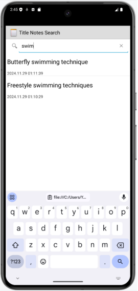

# NotePad-Android应用的介绍文档

## 一.初始应用的功能

### 1.新建笔记和编辑笔记

(1)在主界面点击红色矩形所示按钮，新建笔记并进入编辑界面


(2)进入笔记编辑界面后，可进行笔记编辑


### 2.编辑标题

(1)在笔记编辑界面中点击菜单，显示的菜单条目中有“Edit title”


(2)点击“Edit title”，可编辑笔记标题


### 3.笔记列表

在进行笔记的新建和编辑后，在主界面中呈现笔记列表。在初始应用中背景颜色为黑色，字体颜色为白色，且笔记列表中的每个条目都只显示笔记标题


## 二.拓展基本功能

### （一）.笔记条目增加时间戳显示

#### 1.功能要求

每个新建笔记都会保存新建时间并显示；在修改笔记后更新为修改时间

#### 2.实现思路和技术实现

(1)初始应用的笔记列表`item`只有一个标题，需要再添加一个`TextView`用来显示时间，布局使用 `LinearLayout`

```properties
<LinearLayout  xmlns:android="http://schemas.android.com/apk/res/android"
    android:id="@+id/layout"
    android:layout_width="match_parent"
    android:layout_height="match_parent"
    android:orientation="vertical">
    <!--原标题TextView-->
    <TextView xmlns:android="http://schemas.android.com/apk/res/android"
        android:id="@android:id/text1"
        android:layout_width="match_parent"
        android:layout_height="?android:attr/listPreferredItemHeight"
        android:textAppearance="?android:attr/textAppearanceLarge"
        android:gravity="center_vertical"
        android:paddingLeft="5dip"
        android:singleLine="true"
        />
    <!--添加显示时间的TextView-->
    <TextView
        android:id="@+id/text1_time"
        android:layout_width="match_parent"
        android:layout_height="wrap_content"
        android:textAppearance="?android:attr/textAppearanceSmall"
        android:paddingLeft="5dip"/>
</LinearLayout>
```

(2)`PROJECTION`变量用来定义Java文件定义的`Activity`的数据，所以在`PROJECTION`中加入修改时间作为显示在笔记列表的时间

```properties
private static final String[] PROJECTION = new String[] {
        NotePad.Notes._ID, // 0
        NotePad.Notes.COLUMN_NAME_TITLE, // 1
        NotePad.Notes.COLUMN_NAME_MODIFICATION_DATE
};
```

(3)笔记条目数据通过`SimpleCursorAdapter`装填，其中用到的`dataColumns`，`viewIDs`变量需要添加修改时间

```properties
// The names of the cursor columns to display in the view, initialized to the title column
String[] dataColumns = { NotePad.Notes.COLUMN_NAME_TITLE ,  NotePad.Notes.COLUMN_NAME_MODIFICATION_DATE } ;

// The view IDs that will display the cursor columns, initialized to the TextView in
// noteslist_item.xml
int[] viewIDs = { android.R.id.text1 , R.id.text1_time };
```

(4)对显示的时间戳（`now`变量）进行转换，变成直观的时间格式
在`NotePadProvider`中的`insert`方法和`NoteEditor`中的`updateNote`方法中对`now`变量进行转换，前者为创建笔记时产生的时间，后者为修改笔记时产生的时间。转换后用`ContentValues`的`put`方法将转换后的`dateTime`存入数据库

-`NotePadProvider`中的`insert`方法

```properties
// Gets the current system time in milliseconds
Long now = Long.valueOf(System.currentTimeMillis());
Date date = new Date(now);
SimpleDateFormat format = new SimpleDateFormat("yyyy.MM.dd HH:mm:ss");
String dateTime = format.format(date);

// If the values map doesn't contain the creation date, sets the value to the current time.
if (values.containsKey(NotePad.Notes.COLUMN_NAME_CREATE_DATE) == false) {
    values.put(NotePad.Notes.COLUMN_NAME_CREATE_DATE, dateTime);
}

// If the values map doesn't contain the modification date, sets the value to the current
// time.
if (values.containsKey(NotePad.Notes.COLUMN_NAME_MODIFICATION_DATE) == false) {
    values.put(NotePad.Notes.COLUMN_NAME_MODIFICATION_DATE, dateTime);
}
```

-`NoteEditor`中的`updateNote`方法

```properties
Long now = Long.valueOf(System.currentTimeMillis());
Date date = new Date(now);
SimpleDateFormat format = new SimpleDateFormat("yyyy.MM.dd HH:mm:ss");
String dateTime = format.format(date);
values.put(NotePad.Notes.COLUMN_NAME_MODIFICATION_DATE, dateTime);
```

#### 3.实现效果界面截图

(1)创建笔记时显示创建时间


(2)修改笔记后显示的时间更新为最新修改的时间


### （二）.笔记查询功能（按标题查询）

#### 1.功能要求

点击搜索按钮，进行搜索界面。初始状态的搜索界面不显示笔记条目。在输入搜索内容或回删一部分搜索内容后，系统根据输入内容和笔记的标题进行字符串匹配，刷新符合要求的笔记显示在笔记列表上，后续如果回删搜索内容至为空后，显示所有的笔记

#### 2.实现思路和技术实现

(1)在应用主界面添加一个搜索按钮。在`list_options_menu.xml`中添加一个搜索的`item`，使用Android自带的搜索图标，显示状态为总是显示

```properties
<item
    android:id="@+id/menu_search"
    android:title="@string/menu_search"
    android:icon="@android:drawable/ic_search_category_default"
    android:showAsAction="always" />
```

(2)在安卓中有个用于搜索控件：'SearchView'，可以把'SearchView'跟'ListView'相结合，动态地显示搜索结果。首先实现搜索页面，在'layout'文件夹中新建布局文件'note_search_list.xml'

```properties
<?xml version="1.0" encoding="utf-8"?>
<LinearLayout xmlns:android="http://schemas.android.com/apk/res/android"
    android:orientation="vertical" android:layout_width="match_parent"
    android:layout_height="match_parent">
    <SearchView
        android:id="@+id/search_view"
        android:layout_width="match_parent"
        android:layout_height="wrap_content"
        android:iconifiedByDefault="false"
        android:queryHint="输入搜索内容..."
        android:layout_alignParentTop="true">
    </SearchView>
    <ListView
        android:id="@android:id/list"
        android:layout_width="match_parent"
        android:layout_height="wrap_content">
    </ListView>
</LinearLayout>
```

(3)新建一个NoteSearch类，用于实现搜索的Activity。由于搜索出来的也是笔记列表，所以可以模仿NoteList的activity继承ListActivity。
要动态地显示搜索结果，就要对SearchView文本变化设置监听，NoteSearch除了要继承ListView外还要实现SearchView.OnQueryTextListener接口

```properties
public class NoteSearch extends ListActivity implements SearchView.OnQueryTextListener {
    private static final String[] PROJECTION = new String[] {
            NotePad.Notes._ID, // 0
            NotePad.Notes.COLUMN_NAME_TITLE, // 1
            //扩展 显示时间 颜色
            NotePad.Notes.COLUMN_NAME_MODIFICATION_DATE, // 2
    };
    @Override
    protected void onCreate(Bundle savedInstanceState) {
        super.onCreate(savedInstanceState);
        setContentView(R.layout.note_search_list);
        Intent intent = getIntent();
        if (intent.getData() == null) {
            intent.setData(NotePad.Notes.CONTENT_URI);
        }
        SearchView searchview = (SearchView)findViewById(R.id.search_view);
        //为查询文本框注册监听器
        searchview.setOnQueryTextListener(NoteSearch.this);
    }
    @Override
    public boolean onQueryTextSubmit(String query) {
        return false;
    }
    @Override
    public boolean onQueryTextChange(String newText) {
        String selection = NotePad.Notes.COLUMN_NAME_TITLE + " Like ? ";
        String[] selectionArgs = { "%"+newText+"%" };
        Cursor cursor = managedQuery(
                getIntent().getData(),            // Use the default content URI for the provider.
                PROJECTION,                       // Return the note ID and title for each note. and modifcation date
                selection,                        // 条件左边
                selectionArgs,                    // 条件右边
                NotePad.Notes.DEFAULT_SORT_ORDER  // Use the default sort order.
        );
        String[] dataColumns = { NotePad.Notes.COLUMN_NAME_TITLE ,  NotePad.Notes.COLUMN_NAME_MODIFICATION_DATE};
        int[] viewIDs = { android.R.id.text1 , R.id.text1_time };
        SimpleCursorAdapter adapter = new SimpleCursorAdapter(
                this,
                R.layout.noteslist_item,
                cursor,
                dataColumns,
                viewIDs
        );
        setListAdapter(adapter);
        return true;
    }
    @Override
    protected void onListItemClick(ListView l, View v, int position, long id) {
        // Constructs a new URI from the incoming URI and the row ID
        Uri uri = ContentUris.withAppendedId(getIntent().getData(), id);
        // Gets the action from the incoming Intent
        String action = getIntent().getAction();
        // Handles requests for note data
        if (Intent.ACTION_PICK.equals(action) || Intent.ACTION_GET_CONTENT.equals(action)) {
            // Sets the result to return to the component that called this Activity. The
            // result contains the new URI
            setResult(RESULT_OK, new Intent().setData(uri));
        } else {
            // Sends out an Intent to start an Activity that can handle ACTION_EDIT. The
            // Intent's data is the note ID URI. The effect is to call NoteEdit.
            startActivity(new Intent(Intent.ACTION_EDIT, uri));
        }
    }
}
```

*注意：*
*A.`onListItemClick`方法是点击`NotesList`的`item`跳转到对应笔记编辑界面的方法，`NotesList`中有这个方法，搜索出来的笔记跳转原理与`NotesList`中笔记一样，所以可以直接从`NotesList`中复制过来直接使用。
B.使用`PROJECTION`，`Cursor`，`adapter`方法与时间显示的原理一致
C.动态搜索的实现最主要的部分在`onQueryTextChange`方法中，在使用这个方法，要先为`SearchView`注册监听*

```properties
SearchView searchview = (SearchView)findViewById(R.id.search_view);
//为查询文本框注册监听器
searchview.setOnQueryTextListener(NoteSearch.this);
```

*D.`onQueryTextChange`方法作用是，当`SearchView`中文本发生变化时，执行其中代码，搜索还有一个重要的部分就是要做到模糊匹配而不是严格匹配，可以使用数据库查询语句中的`LIKE`和`%`结合来实现，`newText`为输入搜索的内容*

```properties
String[] selectionArgs = { "%"+newText+"%" };
```

(4)在`AndroidManifest.xml`注册`NoteSearch`

```properties
<activity
    android:name="NoteSearch"
    android:label="@string/title_notes_search"
    android:theme="@android:style/Theme.Holo.Light">
</activity>
```

(5)在`NotesList.java`中的`onOptionsItemSelected`方法有一段`switch-case`语句，实现了点击应用主界面的右上方按钮后的点击交互事件。在这里添加搜索的`case`语句

```properties
case R.id.menu_search:
    Intent intent = new Intent();
    intent.setClass(NotesList.this,NoteSearch.class);
    NotesList.this.startActivity(intent);
    return true;
```

#### 3.实现效果界面截图

(1)点击搜索按钮进行搜索界面


(2)输入搜索内容，显示符合条件的笔记



(3)回删搜素内容至空时，显示所有的笔记


## 三.拓展附加功能

### （一）.UI美化

#### 1.功能要求

在笔记编辑时可以对其切换编辑界面的背景颜色，同时更换笔记列表中的该笔记颜色（和编辑界面背景颜色相同）

#### 2.实现思路和技术实现

(1)给`NotesList`换个主题，把暗黑风换成白亮风。在`AndroidManifest.xml`中`NotesList`的`Activity`中修改

```properties
<activity android:name="NotesList" android:label="@string/title_notes_list" android:theme="@android:style/Theme.Holo.Light">
```

(2)为了实现笔记的背景颜色能够永久保存，在数据库中添加一个颜色的字段。在`NotePad`类中的`Notes`类中声明`COLUMN_NAME_BACK_COLOR`变量，并使用`int`数据类型定义好五种不同的颜色变量

```properties
public static final String COLUMN_NAME_BACK_COLOR = "color";
public static final int DEFAULT_COLOR = 0; //白色
public static final int YELLOW_COLOR = 1; //黄色
public static final int BLUE_COLOR = 2; //蓝色
public static final int GREEN_COLOR = 3; //绿色
public static final int RED_COLOR = 4; //红色
```

(3)在创建数据库表处（`DatabaseHelper`类中的`onCreate`方法）添加颜色字段

```properties
public void onCreate(SQLiteDatabase db) {
    db.execSQL("CREATE TABLE " + NotePad.Notes.TABLE_NAME + " ("
            + NotePad.Notes._ID + " INTEGER PRIMARY KEY,"
            + NotePad.Notes.COLUMN_NAME_TITLE + " TEXT,"
            + NotePad.Notes.COLUMN_NAME_NOTE + " TEXT,"
            + NotePad.Notes.COLUMN_NAME_CREATE_DATE + " INTEGER,"
            + NotePad.Notes.COLUMN_NAME_MODIFICATION_DATE + " INTEGER,"
            + NotePad.Notes.COLUMN_NAME_BACK_COLOR + " INTEGER"
            + ");");
}
```

(4)在`NotePadProvider`类中对新增的颜色字段做相应处理，
在`static{}`中添加

```properties
sNotesProjectionMap.put(
        NotePad.Notes.COLUMN_NAME_BACK_COLOR,
        NotePad.Notes.COLUMN_NAME_BACK_COLOR);
}
```

在`insert`方法中添加

```properties
if (values.containsKey(NotePad.Notes.COLUMN_NAME_BACK_COLOR) == false) {
    values.put(NotePad.Notes.COLUMN_NAME_BACK_COLOR, NotePad.Notes.DEFAULT_COLOR);
}
```

*实现新建笔记时，背景颜色默认为白色*

(5)原有的`SimpleCursorAdapter`无法满足填充背景颜色的功能，所以自定义一个`CursorAdapter`类继承`SimpleCursorAdapter`，既能完成`cursor`读取的数据库内容填充到`item`，又能将颜色填充。将其命名为`MyCursorAdapter`。
将颜色填充到ListView，可以使用SimpleCursorAdapter中的bindView方法来实现

```properties
public class MyCursorAdapter extends SimpleCursorAdapter {
    public MyCursorAdapter(Context context, int layout, Cursor c, String[] from, int[] to) {
        super(context, layout, c, from, to);
    }

    @Override
    public void bindView(View view, Context context, Cursor cursor) {
        super.bindView(view, context, cursor);

        int x = cursor.getInt(cursor.getColumnIndex(NotePad.Notes.COLUMN_NAME_BACK_COLOR));

        switch (x) {
            case NotePad.Notes.DEFAULT_COLOR:
                view.setBackgroundColor(Color.rgb(255, 255, 255));
                break;
            case NotePad.Notes.YELLOW_COLOR:
                view.setBackgroundColor(Color.rgb(247, 216, 133));
                break;
            case NotePad.Notes.BLUE_COLOR:
                view.setBackgroundColor(Color.rgb(165, 202, 237));
                break;
            case NotePad.Notes.GREEN_COLOR:
                view.setBackgroundColor(Color.rgb(161, 214, 174));
                break;
            case NotePad.Notes.RED_COLOR:
                view.setBackgroundColor(Color.rgb(244, 149, 133));
                break;
            default:
                view.setBackgroundColor(Color.rgb(255, 255, 255));
                break;
        }
    }
}
```

(6)将`NotesList`类中的`PROJECTION`添加颜色变量

```properties
private static final String[] PROJECTION = new String[] {
        NotePad.Notes._ID, // 0
        NotePad.Notes.COLUMN_NAME_TITLE, // 1
        NotePad.Notes.COLUMN_NAME_MODIFICATION_DATE,
        NotePad.Notes.COLUMN_NAME_BACK_COLOR,
};
```

并把该类中使用的SimpleCursorAdapter改成MyCursorAdapter

```properties
MyCursorAdapter adapter = new MyCursorAdapter(
        this,                             // The Context for the ListView
        R.layout.noteslist_item,          // Points to the XML for a list item
        cursor,                           // The cursor to get items from
        dataColumns,
        viewIDs
);
```

(7)此时运行会发现系统报错：2024-11-28 10:21:11.138 23752-23752 SQLiteLog               com.example.android.notepad          E  (1) `no such column`: color in "SELECT _id, title, modified, color FROM notes ORDER BY modified DESC"

使用**数据库版本升级**的办法，将NotePadProvider类中的DATABASE_VERSION变量由2改成3

```properties
private static final int DATABASE_VERSION = 3;
```

(8)编辑笔记的`Activity`在`NoteEditor`类中实现。为了实现编辑笔记时的背景色更换，在`NoteEditor`类中的`PROJECTION`变量中添加颜色

```properties
private static final String[] PROJECTION =
    new String[] {
        NotePad.Notes._ID,
        NotePad.Notes.COLUMN_NAME_TITLE,
        NotePad.Notes.COLUMN_NAME_NOTE,
        NotePad.Notes.COLUMN_NAME_BACK_COLOR
};
```

(9)在`NoteEditor`类中有`onResume()`方法，onResume()方法在正常启动时会被调用，一般是`onStart()`后会执行onResume()，在`Acitivity`从Pause状态转化到Active状态也会被调用。利用这个特点，将从数据库读取颜色并设置编辑界面背景色的操作放入其中，这样除了从笔记列表点进来时可以被执行到，跳到改变颜色的`Activity`（接下来会提到），改变后也会被执行到
在NoteEditor类中的onResume()方法添加读取颜色数据的操作

```properties
    int x = mCursor.getInt(mCursor.getColumnIndex(NotePad.Notes.COLUMN_NAME_BACK_COLOR));
    switch (x){
        case NotePad.Notes.DEFAULT_COLOR:
            mText.setBackgroundColor(Color.rgb(255, 255, 255));
            break;
        case NotePad.Notes.YELLOW_COLOR:
            mText.setBackgroundColor(Color.rgb(247, 216, 133));
            break;
        case NotePad.Notes.BLUE_COLOR:
            mText.setBackgroundColor(Color.rgb(165, 202, 237));
            break;
        case NotePad.Notes.GREEN_COLOR:
            mText.setBackgroundColor(Color.rgb(161, 214, 174));
            break;
        case NotePad.Notes.RED_COLOR:
            mText.setBackgroundColor(Color.rgb(244, 149, 133));
            break;
        default:
            mText.setBackgroundColor(Color.rgb(255, 255, 255));
            break;
    }
```

(10)在编辑界面的菜单xml文件`editor_options_menu.xml`中添加更改背景颜色的`item`，图标为Android自带，显示状态为总是显示

```properties
<item android:id="@+id/menu_color"
      android:title="@string/menu_color"
      android:icon="@android:drawable/ic_menu_preferences"
      android:showAsAction="always"/>
```

(11)点击更改背景颜色的`item`图标，要显示一个对话框界面用于让用户选择颜色。所以新建布局`note_color.xml`，垂直线性布局放置5个`ImageButton`

```properties
<?xml version="1.0" encoding="utf-8"?>
<LinearLayout xmlns:android="http://schemas.android.com/apk/res/android"
    android:orientation="horizontal" android:layout_width="match_parent"
    android:layout_height="match_parent">
    <ImageButton
        android:id="@+id/color_white"
        android:layout_width="0dp"
        android:layout_height="50dp"
        android:layout_weight="1"
        android:background="@color/white"
        android:onClick="white"/>
    <ImageButton
        android:id="@+id/color_yellow"
        android:layout_width="0dp"
        android:layout_height="50dp"
        android:layout_weight="1"
        android:background="@color/yellow"
        android:onClick="yellow"/>
    <ImageButton
        android:id="@+id/color_blue"
        android:layout_width="0dp"
        android:layout_height="50dp"
        android:layout_weight="1"
        android:background="@color/blue"
        android:onClick="blue"/>
    <ImageButton
        android:id="@+id/color_green"
        android:layout_width="0dp"
        android:layout_height="50dp"
        android:layout_weight="1"
        android:background="@color/green"
        android:onClick="green"/>
    <ImageButton
        android:id="@+id/color_red"
        android:layout_width="0dp"
        android:layout_height="50dp"
        android:layout_weight="1"
        android:background="@color/red"
        android:onClick="red"/>
</LinearLayout>
```

在新建`note_color.xml`之前创建好`color.xml`文件，定义好几种颜色

```properties
<?xml version="1.0" encoding="utf-8"?>
<resources>
    <color name="black">#000000</color>
    <color name="yellow">#FFFF00</color>
    <color name="blue">#0000FF</color>
    <color name="green">#008000</color>
    <color name="red">#FF0000</color>
    <color name="white">#FFFFFF</color>
</resources>
```

(12)创建`NoteColor`的`Acitvity`，用来选择颜色

```properties
public class NoteColor extends Activity {
    private Cursor mCursor;
    private Uri mUri;
    private int color;
    private static final int COLUMN_INDEX_TITLE = 1;
    private static final String[] PROJECTION = new String[] {
            NotePad.Notes._ID, // 0
            NotePad.Notes.COLUMN_NAME_BACK_COLOR,
    };
    public void onCreate(Bundle savedInstanceState) {
        super.onCreate(savedInstanceState);
        setContentView(R.layout.note_color);
        //从NoteEditor传入的uri
        mUri = getIntent().getData();
        mCursor = managedQuery(
                mUri,        // The URI for the note that is to be retrieved.
                PROJECTION,  // The columns to retrieve
                null,        // No selection criteria are used, so no where columns are needed.
                null,        // No where columns are used, so no where values are needed.
                null         // No sort order is needed.
        );
    }
    @Override
    protected void onResume(){
        //执行顺序在onCreate之后
        if (mCursor != null) {
            mCursor.moveToFirst();
            color = mCursor.getInt(COLUMN_INDEX_TITLE);
        }
        super.onResume();
    }
    @Override
    protected void onPause() {
        //执行顺序在finish()之后，将选择的颜色存入数据库
        super.onPause();
        ContentValues values = new ContentValues();
        values.put(NotePad.Notes.COLUMN_NAME_BACK_COLOR, color);
        getContentResolver().update(mUri, values, null, null);
    }
    public void white(View view){
        color = NotePad.Notes.DEFAULT_COLOR;
        finish();
    }
    public void yellow(View view){
        color = NotePad.Notes.YELLOW_COLOR;
        finish();
    }
    public void blue(View view){
        color = NotePad.Notes.BLUE_COLOR;
        finish();
    }
    public void green(View view){
        color = NotePad.Notes.GREEN_COLOR;
        finish();
    }
    public void red(View view){
        color = NotePad.Notes.RED_COLOR;
        finish();
    }

}
```

(13)在`AndroidManifest.xml`中新增`NoteColor`的`Acitvity`，并把该活动的主题定义为对话框样式

```properties
<activity android:name="NoteColor"
    android:theme="@android:style/Theme.Holo.Light.Dialog"
    android:label="ChangeColor"
    android:windowSoftInputMode="stateVisible"/>
```

(14)在`NoteEditor`中添加函数`changeColor()`，跳转改变颜色的`activity`，将`uri`信息传到新的`activity`

```properties
private final void changeColor() {
    Intent intent = new Intent(null,mUri);
    intent.setClass(NoteEditor.this,NoteColor.class);
    NoteEditor.this.startActivity(intent);
}
```

(15)在`NoteEditor.java`中的`onOptionsItemSelected`方法有一段`switch-case`语句，实现了点击编辑界面的右上方按钮后的点击交互事件。在这里添加修改背景颜色的`case`语句

```properties
case R.id.menu_color:
    changeColor();
    break;
```

#### 3.实现效果界面截图

(1)在笔记编辑时对其切换编辑界面的背景颜色

-点击笔记进入编辑界面，在编辑界面中点击右上方的改变背景颜色按钮


-选择背景颜色


-修改背景颜色后的编辑页面和返回应用主页面后的笔记列表


(2)更换背景颜色后的笔记列表


### （二）.笔记导出

#### 1.功能要求

在笔记编辑界面点击右上角的菜单按钮，显示导出文件选项，点击后显示对话框，用户输入导入文件的名称后点击确定即可将指定笔记保存到本地

#### 2.实现思路和技术实现

(1)在编辑界面的菜单xml文件`editor_options_menu.xml`中添加导出文件的`item`

```properties
<item android:id="@+id/menu_output"
      android:title="@string/menu_output" />
```

(2)编辑点击导出文件选项后显示的对话框。新建布局`output_text.xml`，垂直线性布局放置`EditText`和`Button`

```properties
<?xml version="1.0" encoding="utf-8"?>
<LinearLayout xmlns:android="http://schemas.android.com/apk/res/android"
    android:layout_width="wrap_content"
    android:layout_height="wrap_content"
    android:orientation="vertical"
    android:paddingLeft="6dip"
    android:paddingRight="6dip"
    android:paddingBottom="3dip">
    <EditText android:id="@+id/output_name"
        android:maxLines="1"
        android:layout_marginTop="2dp"
        android:layout_marginBottom="15dp"
        android:layout_width="wrap_content"
        android:ems="25"
        android:layout_height="wrap_content"
        android:autoText="true"
        android:capitalize="sentences"
        android:scrollHorizontally="true" />
    <Button android:id="@+id/output_ok"
        android:layout_width="wrap_content"
        android:layout_height="wrap_content"
        android:layout_gravity="right"
        android:text="@string/output_ok"
        android:onClick="OutputOk" />
</LinearLayout>
```

(3)创建导出文件的活动`OutputText`，用来实现导出文件

```properties
public class OutputText extends Activity {
    //要使用的数据库中笔记的信息
    private static final String[] PROJECTION = new String[] {
            NotePad.Notes._ID, // 0
            NotePad.Notes.COLUMN_NAME_TITLE, // 1
            NotePad.Notes.COLUMN_NAME_NOTE, // 2
            NotePad.Notes.COLUMN_NAME_CREATE_DATE, // 3
            NotePad.Notes.COLUMN_NAME_MODIFICATION_DATE, // 4
    };
    //读取出的值放入这些变量
    private String TITLE;
    private String NOTE;
    private String CREATE_DATE;
    private String MODIFICATION_DATE;
    //读取该笔记信息
    private Cursor mCursor;
    //导出文件的名字
    private EditText mName;
    //NoteEditor传入的uri，用于从数据库查出该笔记
    private Uri mUri;
    //关于返回与保存按钮的一个特殊标记，返回的话不执行导出，点击按钮才导出
    private boolean flag = false;
    private static final int COLUMN_INDEX_TITLE = 1;
    public void onCreate(Bundle savedInstanceState) {
        super.onCreate(savedInstanceState);
        setContentView(R.layout.output_text);
        mUri = getIntent().getData();
        mCursor = managedQuery(
                mUri,        // The URI for the note that is to be retrieved.
                PROJECTION,  // The columns to retrieve
                null,        // No selection criteria are used, so no where columns are needed.
                null,        // No where columns are used, so no where values are needed.
                null         // No sort order is needed.
        );
        mName = (EditText) findViewById(R.id.output_name);
    }
    @Override
    protected void onResume(){
        super.onResume();
        if (mCursor != null) {
            // The Cursor was just retrieved, so its index is set to one record *before* the first
            // record retrieved. This moves it to the first record.
            mCursor.moveToFirst();
            //编辑框默认的文件名为标题，可自行更改
            mName.setText(mCursor.getString(COLUMN_INDEX_TITLE));
        }
    }
    @Override
    protected void onPause() {
        super.onPause();
        if (mCursor != null) {
            //从mCursor读取对应值
            TITLE = mCursor.getString(mCursor.getColumnIndex(NotePad.Notes.COLUMN_NAME_TITLE));
            NOTE = mCursor.getString(mCursor.getColumnIndex(NotePad.Notes.COLUMN_NAME_NOTE));
            CREATE_DATE = mCursor.getString(mCursor.getColumnIndex(NotePad.Notes.COLUMN_NAME_CREATE_DATE));
            MODIFICATION_DATE = mCursor.getString(mCursor.getColumnIndex(NotePad.Notes.COLUMN_NAME_MODIFICATION_DATE));
            //flag在点击导出按钮时会设置为true，执行写文件
            if (flag == true) {
                write();
            }
            flag = false;
        }
    }
    public void OutputOk(View v){
        flag = true;
        finish();
    }
    private void write()
    {
        try
        {
            // 如果手机插入了SD卡，而且应用程序具有访问SD的权限
            if (Environment.getExternalStorageState().equals(
                    Environment.MEDIA_MOUNTED)) {
                // 获取SD卡的目录
                File sdCardDir = Environment.getExternalStorageDirectory();
                //创建文件目录
                File targetFile = new File(sdCardDir.getCanonicalPath() + "/" + mName.getText() + ".txt");
                //写文件
                PrintWriter ps = new PrintWriter(new OutputStreamWriter(new FileOutputStream(targetFile), "UTF-8"));
                ps.println(TITLE);
                ps.println(NOTE);
                ps.println("创建时间：" + CREATE_DATE);
                ps.println("最后一次修改时间：" + MODIFICATION_DATE);
                ps.close();
                Toast.makeText(this, "保存成功,保存位置：" + sdCardDir.getCanonicalPath() + "/" + mName.getText() + ".txt", Toast.LENGTH_LONG).show();
            }
        }
        catch (Exception e)
        {
            e.printStackTrace();
        }
    }
}
```

(4)在`AndroidManifest.xml`中新增`OutputText`的`Acitvity`，并把该活动的主题定义为对话框样式

```properties
<activity android:name="OutputText"
    android:label="@string/output_name"
    android:theme="@android:style/Theme.Holo.Dialog"
    android:windowSoftInputMode="stateVisible">
</activity>
```

(5)在`AndroidManifest.xml`中新增对SD卡进行创建、删除文件和向SD卡写入数据的权限，注意和`application`同级，否则程序报错无法运行

```properties
<!-- 在SD卡中创建与删除文件权限 -->
<uses-permission android:name="android.permission.MOUNT_UNMOUNT_FILESYSTEMS"
    tools:ignore="ProtectedPermissions,WrongManifestParent" />
<!-- 向SD卡写入数据权限 -->
<uses-permission android:name="android.permission.WRITE_EXTERNAL_STORAGE"
    tools:ignore="WrongManifestParent" />
```

(6)在`NoteEditor`中添加函数`outputNote()`，跳转导出笔记的`activity`，将`uri`信息传到新的`activity`

```properties
private final void outputNote() {
    Intent intent = new Intent(null,mUri);
    intent.setClass(NoteEditor.this,OutputText.class);
    NoteEditor.this.startActivity(intent);
}
```

(7)在`NoteEditor.java`中的`onOptionsItemSelected`方法中的一段`switch-case`语句中添加导出文件的`case`语句

```properties
case R.id.menu_output:
    outputNote();
    break;
```

#### 3.实现效果界面截图

(1)在笔记编辑界面点击右上角的菜单按钮，显示导出文件选项，点击后显示对话框


(2)用户在对话框中输入导入文件的名称后点击OK，指定笔记被保存到本地


(3)打开模拟器的文件管理器查看笔记是否被保存到本地


### （三）.笔记排序

#### 1.功能要求

在应用主界面点击排序按钮，便会显示三种排序方式：创建时间、修改时间、颜色。点击一种排序方式后，笔记列表依据选中的排序方式进行排序

#### 2.实现思路和技术实现

(1)在应用主界面的菜单xml文件`list_options_menu.xml`中添加排序图标的`item`

```properties
<item
    android:id="@+id/menu_sort"
    android:title="@string/menu_sort"
    android:icon="@android:drawable/ic_menu_sort_by_size"
    android:showAsAction="always" >
    <menu>
        <item
            android:id="@+id/menu_sort1"
            android:title="@string/menu_sort1"/>
        <item
            android:id="@+id/menu_sort2"
            android:title="@string/menu_sort2"/>
        <item
            android:id="@+id/menu_sort3"
            android:title="@string/menu_sort3"/>
    </menu>
</item>
```

(2)在`NotesList.java`中的`onOptionsItemSelected`方法有一段`switch-case`语句，实现了点击应用主界面的右上方按钮后的点击交互事件。在这里添加搜索的`case`语句

```properties
//创建时间排序
case R.id.menu_sort1:
    cursor = managedQuery(
            getIntent().getData(),
            PROJECTION,
            null,
            null,
            NotePad.Notes._ID
    );
    adapter = new MyCursorAdapter(
            this,
            R.layout.noteslist_item,
            cursor,
            dataColumns,
            viewIDs
    );
    setListAdapter(adapter);
    return true;
//修改时间排序
case R.id.menu_sort2:
    cursor = managedQuery(
            getIntent().getData(),
            PROJECTION,
            null,
            null,
            NotePad.Notes.DEFAULT_SORT_ORDER
    );
    adapter = new MyCursorAdapter(
            this,
            R.layout.noteslist_item,
            cursor,
            dataColumns,
            viewIDs
    );
    setListAdapter(adapter);
    return true;
//颜色排序
case R.id.menu_sort3:
    cursor = managedQuery(
            getIntent().getData(),
            PROJECTION,
            null,
            null,
            NotePad.Notes.COLUMN_NAME_BACK_COLOR
    );
    adapter = new MyCursorAdapter(
            this,
            R.layout.noteslist_item,
            cursor,
            dataColumns,
            viewIDs
    );
    setListAdapter(adapter);
    return true;
```

(3)由于排序会多次使用到`cursor`，`adapter`，所以将`adapter`,`cursor`,`dataColumns`,`viewIDs`定义在`onOptionsItemSelected`函数外，`NotesList`类内

```properties
private MyCursorAdapter adapter;
private Cursor cursor;
private String[] dataColumns = { NotePad.Notes.COLUMN_NAME_TITLE ,  NotePad.Notes.COLUMN_NAME_MODIFICATION_DATE } ;
private int[] viewIDs = { android.R.id.text1 , R.id.text1_time };
```

#### 3.实现效果界面截图

(1)在应用主界面点击排序按钮，便会显示三种排序方式


(2)点击一种排序方式后，笔记列表依据选中的排序方式进行排序

-按照创建时间排序


-按照修改时间排序


-按照颜色排序

